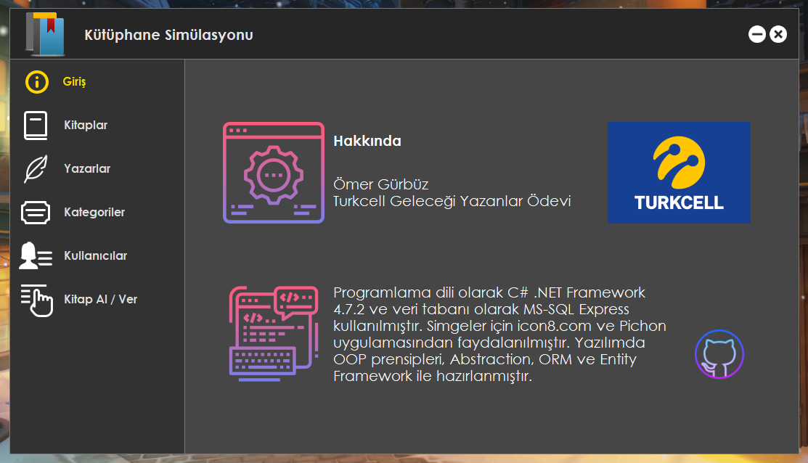

# Library Simulation

Turkcell Geleceği Yazanlar Programı Ödevi

Hazırlamış olduğumuz veritabanı diyagramını program haline getirerek sunuyoruz. OOP, Abstraction, ORM, Entity Framework ve MS-SQL kullanılmıştır.

Ana Ekran

