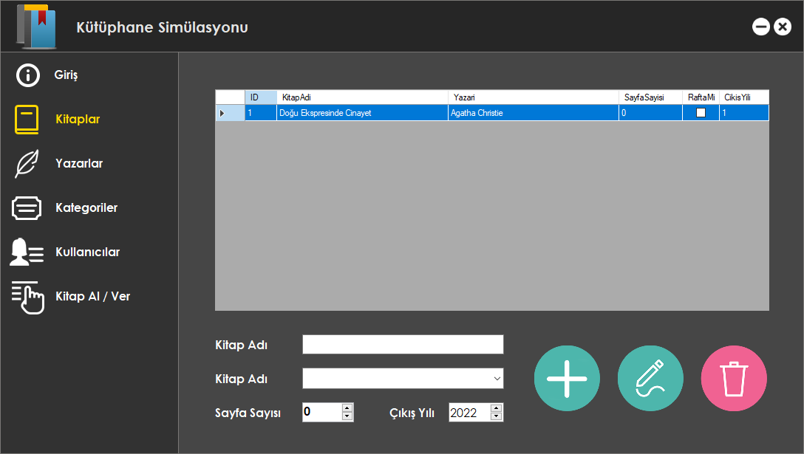
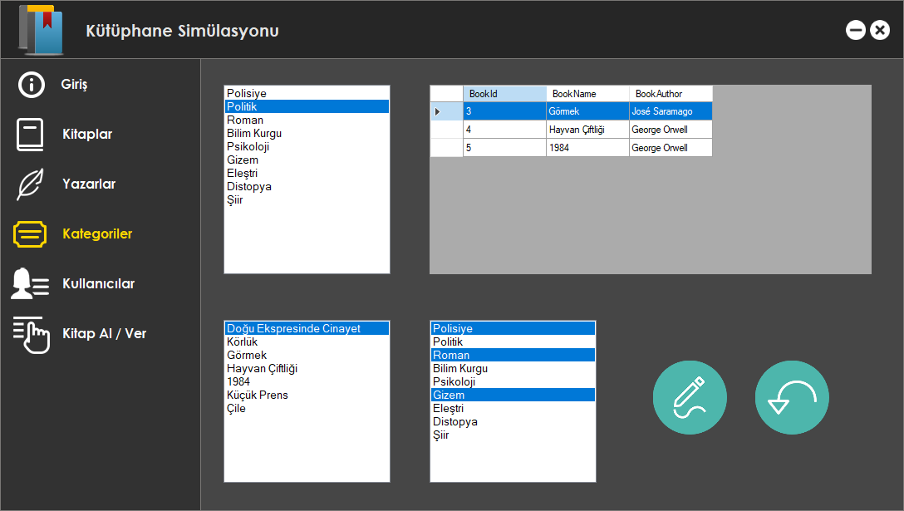

# Library Simulation

Turkcell Geleceği Yazanlar Programı Ödevi

Hazırlamış olduğumuz veritabanı diyagramını program haline getirerek sunuyoruz. OOP, ORM, Entity Framework ve MS-SQL kullanılmıştır.

Ana Ekran

Kitaplar Ekranı

Yazarlar Ekranı (Düzenleme Modunda)

Kategoriler Ekranı

Kategori Detayları Ekranı

Kullanıcılar Ekranı

Kitap Al/Ver Ekranı

Form design ekranının açılmama sebebini uzun uzadıya araştırmam sonucu, bu hatanın derleyici kaynaklı olduğunu öğrendim. Derleme sırasında herhangi bir hata ile karşılaşılmamaktadır.
